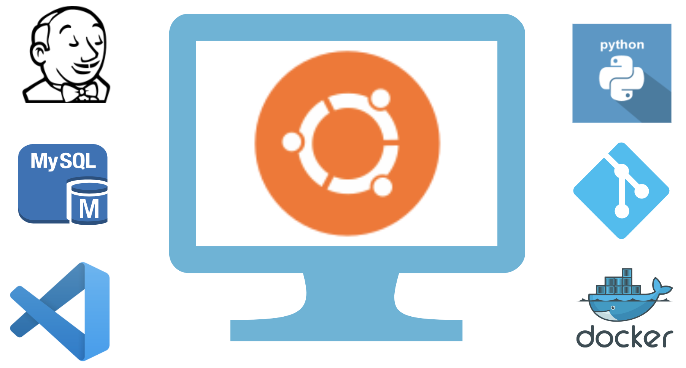

# TIC4302-app-Devsecops

This repository contains required materials and scripts for building a DevSecOps pipeline covered in the course TIC4302

The repository contains code for the environment that spwans a lab environment with a VM installed with required tools 

The source code for intentionally designed vulnerable application [ChaimTube](app/).
 

